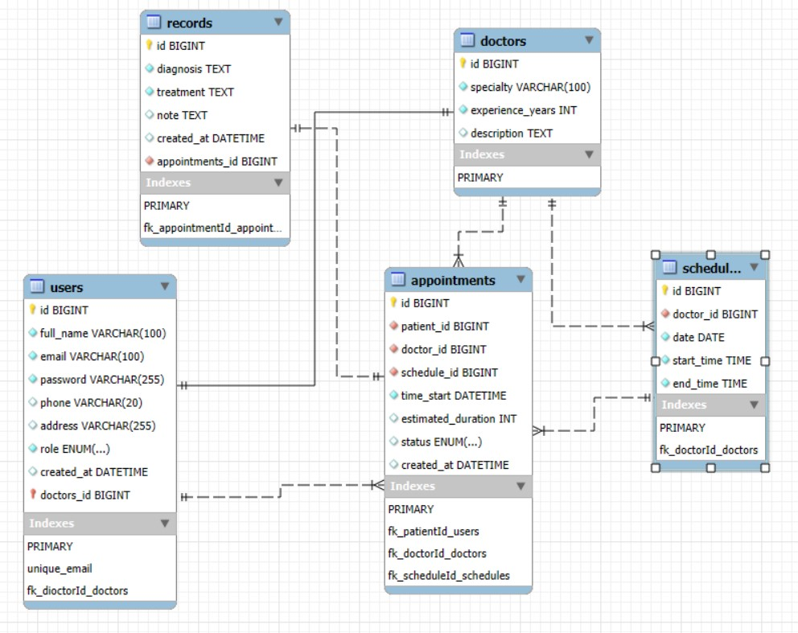

**MediBooking - Nền tảng đặt lịch tư vấn sức khoẻ trực tuyến**

## 1. Mục đích dự án

Xây dựng một nền tảng giúp bệnh nhân dễ dàng tìm bác sĩ, xem lịch, đặt lịch và nhận tư vấn.

## 2. Tính năng chính

### ● Auth (cho PATIENT, DOCTOR, ADMIN)

* Đăng ký, đăng nhập, phân quyền theo vai trò
* Xác thực bằng JWT

### ● Patient

* Xem danh sách bác sĩ theo chuyên khoa
* Xem lịch trực bác sĩ
* Đặt lịch tư vấn
* Xem/trình sửa thông tin tài khoản cá nhân
* Xem lịch sử lịch hẹn và hồ sơ bệnh án của mình

### ● Doctor

* Xem và thiết lập lịch trực
* Quản lý lịch hẹn: xác nhận, từ chối, hoàn thành
* Ghi hồ sơ bệnh án (chẩn đoán, điều trị)
* Xem danh sách bệnh nhân đã tư vấn

### ● Admin

* Quản lý người dùng: thêm/sửa/xóa PATIENT và DOCTOR
* Quản lý chuyên khoa bác sĩ
* Xem danh sách lịch hẹn, hồ sơ bệnh án

## 3. Công nghệ sử dụng

* Backend: Spring Boot, Spring Security, JWT, JPA (Hibernate), MySQL
* Frontend: ReactJS
* Triển khai: Railway (backend), Vercel (frontend)

## 4. Cấu trúc thư mục backend

```bash
backend/
├── src/
│   ├── main/java/com/medibooking/
│   │   ├── auth/          # Xử lý đăng nhập/đăng ký + bảo mật
│   │   ├── user/          # Quản lý thông tin người dùng
│   │   ├── doctor/        # Chức năng riêng cho bác sĩ
│   │   ├── schedule/      # Lịch trực bác sĩ
│   │   ├── appointment/   # Đặt lịch tư vấn
│   │   └── record/        # Hồ sơ bệnh án
│   └── resources/
│       └── application.properties
└── README.md
```

## 5. Phân quyền API

* `ADMIN`: truy cập tất cả API
* `DOCTOR`: API cho lịch trực, lịch hẹn, hồ sơ bệnh án
* `PATIENT`: API xem bác sĩ, lịch trực, đặt lịch, xem hồ sơ cá nhân
* API chung: đăng nhập, đăng ký, xem chuyên khoa

## 6. Cở sở dữ liệu

**Sơ đồ ERD:** 

Các file SQL: xem trong `docs/db/`
